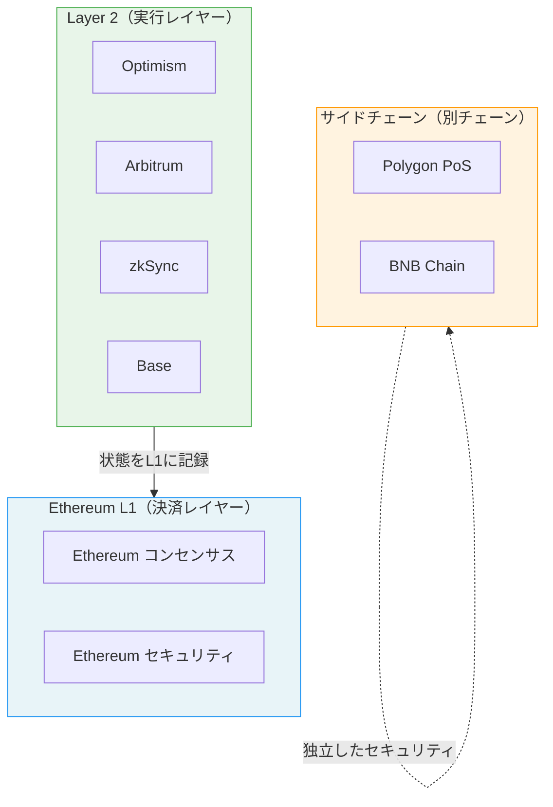
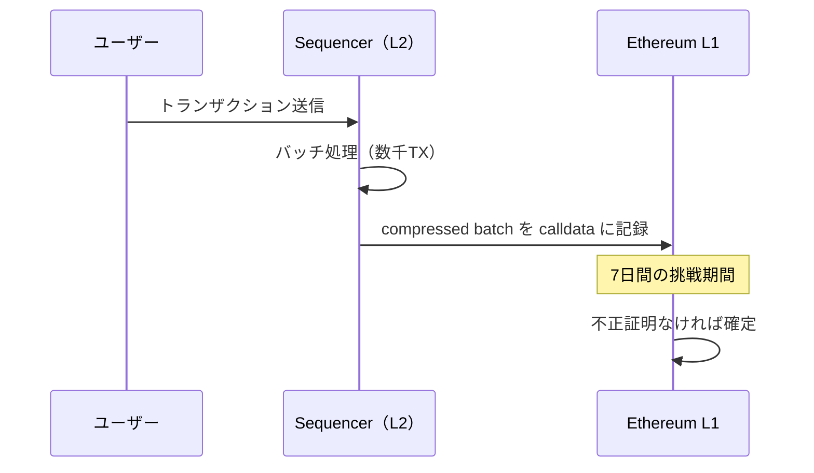
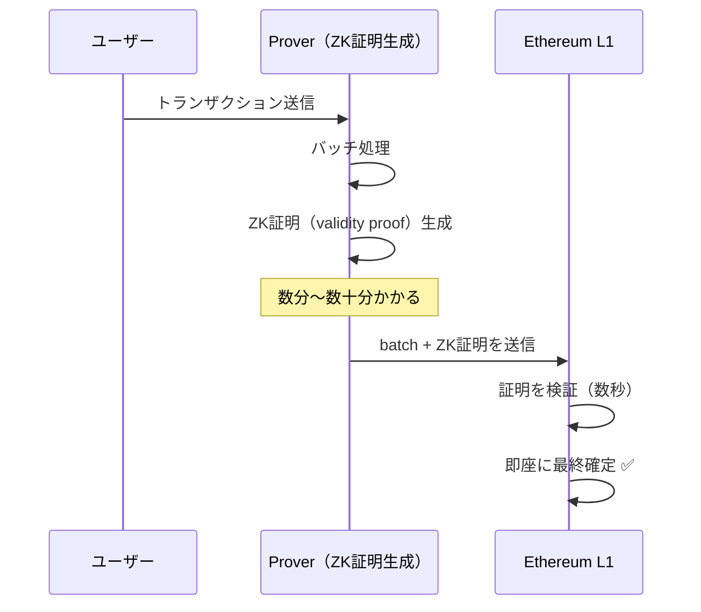
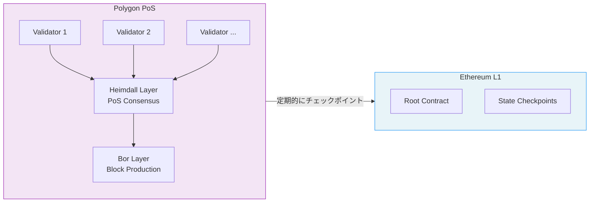
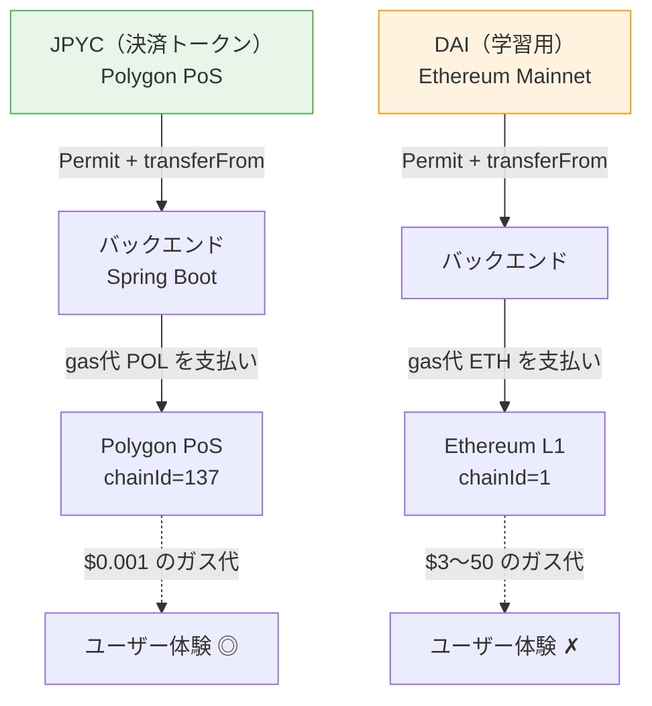

# レポート16 — Layer 2 完全解説：なぜ Ethereum は遅いのか、そして解決策

> 対象読者: Web3 初心者 / このプロジェクトで Polygon を使う理由を深く理解したい人

---

## 1. Ethereum のスケーラビリティ問題

### ブロックチェーン・トリレンマ

Vitalik Buterin が提唱した「ブロックチェーン・トリレンマ」は、以下の3つを同時に完全に実現することは難しいという概念です。

```
        分散性 (Decentralization)
             △
            / \
           /   \
          /     \
         /  選べるのは \
        /   2つだけ？  \
       ◯───────────────◯
  安全性           スケーラビリティ
 (Security)       (Scalability)
```

| チェーン | 分散性 | 安全性 | スケーラビリティ |
|---|---|---|---|
| Bitcoin | ◎ | ◎ | ✗（7 TPS） |
| Ethereum L1 | ◎ | ◎ | △（15-30 TPS） |
| Solana | △ | △ | ◎（65,000 TPS）|
| Polygon PoS | ○ | ○ | ◎（7,000 TPS）|
| Ethereum L2 | ◎（Lの安全性） | ◎ | ◎（目標） |

Ethereum は意図的に「分散性と安全性」を優先し、スケーラビリティを犠牲にした設計です。

### Ethereum L1 の実際のスループット

```
1ブロック ≈ 12秒
1ブロックのガス上限 ≈ 30,000,000 gas
ERC-20 Transfer ≈ 65,000 gas

→ 1秒あたりの Transfer 処理数 ≈ 30,000,000 ÷ 65,000 ÷ 12 ≈ 38 TPS
```

VisaのTPSが約24,000であることを考えると、Ethereum L1 だけでは到底グローバルな決済インフラになれません。

---

## 2. Layer 2 とは何か

Layer 2（L2）は「Ethereum L1 の上に乗っかった別の実行レイヤー」です。



**重要な違い:**
- **Layer 2**: Ethereum のセキュリティを **継承** する（状態をL1に記録）
- **サイドチェーン（Polygon PoS）**: 独自のバリデータセットを持つ **独立したチェーン**

> **このプロジェクトで使っている Polygon PoS は厳密には L2 ではなくサイドチェーンです。**
> セキュリティモデルが異なりますが、EVM 互換で安価なため JPYC の決済に適しています。

---

## 3. Optimistic Rollup の仕組み

Optimism・Arbitrum が採用する方式です。



**「楽観的」な理由**: 不正がないと楽観的に仮定してトランザクションを確定させ、不正があった場合にだけ証明で覆す設計。

| 項目 | 値 |
|---|---|
| ガス削減率 | 約10〜100倍安い |
| L1 最終確定まで | 7日間（挑戦期間） |
| EVM 互換性 | ほぼ完全互換 |
| 代表例 | Optimism, Arbitrum One |

**デメリット**: L2 → L1 への引き出し（ブリッジ）に7日かかる。高速ブリッジサービス（Hop, Across）で回避可能。

---

## 4. ZK Rollup の仕組み

zkSync・StarkNet・Polygon zkEVM が採用する方式です。



**「ゼロ知識」の意味**: 計算が正しいことを、計算内容を明かさずに証明できる暗号技術。

| 項目 | 値 |
|---|---|
| ガス削減率 | 約100〜1000倍安い（理論値） |
| L1 最終確定まで | 数分〜数時間（証明生成待ち） |
| EVM 互換性 | zkEVM で向上中（まだ制限あり） |
| 代表例 | zkSync Era, StarkNet, Polygon zkEVM |

**メリット**: 引き出しに7日待たなくていい。数学的な確実性がある。  
**デメリット**: ZK証明の生成が重い（計算コスト）。EVM 完全互換はまだ難しい。

---

## 5. Polygon PoS の特殊性

このプロジェクトで使っている Polygon PoS は、Rollup ではなく **プラズマ + PoS コンセンサスのサイドチェーン** です。



**Polygon PoS のセキュリティモデル:**
- 独自の ~100 バリデータセット（MATIC/POL をステーク）
- 定期的にチェックポイントを Ethereum に記録
- Ethereum のセキュリティを完全には継承しないが、現実的なトレードオフ

**数値で見る優位性:**

| 指標 | Ethereum L1 | Polygon PoS |
|---|---|---|
| ブロック時間 | ~12秒 | ~2秒 |
| ERC-20 Transfer ガス代 | $3〜50 | $0.001〜0.01 |
| TPS | ~30 | ~7,000 |
| ファイナリティ | 数分 | ~2分（チェックポイント） |
| JPYC コントラクト | なし | あり ✅ |

---

## 6. L2 vs サイドチェーン — どちらを選ぶべきか

```
目的別の選択ガイド:

高額な DeFi / 資産管理
  → Ethereum L1 または Arbitrum/Optimism（セキュリティ最優先）

日常的な決済（低額、頻度高い）
  → Polygon PoS または Base（速度・コスト優先）← このプロジェクト

NFT ミント（アート系）
  → Polygon PoS（安さ）または Ethereum L1（ブランド力）

企業向け / コンプライアンス重視
  → Optimism（Coinbase の Base も同系列）

ZK 最新技術を試したい
  → zkSync Era または Polygon zkEVM
```

---

## 7. このプロジェクトへの影響



- **JPYC on Polygon**: 決済ガス代は数円以下 → 実用的
- **DAI on Ethereum**: ガス代が決済額を超える可能性 → 学習用参照のみ
- **将来的な移行先**: USDC on Arbitrum / Base も有力候補（Circle ネイティブ発行）

---

## まとめ

| 概念 | 一言で |
|---|---|
| Ethereum L1 | 最高の安全性・分散性、でも遅くて高い |
| Optimistic Rollup | L1 安全性を継承、7日引き出し問題あり |
| ZK Rollup | 数学的証明、速い確定、将来の主流 |
| Polygon PoS | サイドチェーン、速い・安い、JPYC はここ |
| ブロックチェーン・トリレンマ | 分散性・安全性・スケーラビリティの3つは同時に完璧にできない |

L2 の進化は止まらず、2024〜2025年の **EIP-4844（blob transactions）** により Rollup のコストがさらに1/10になりました（→ report-20参照）。
