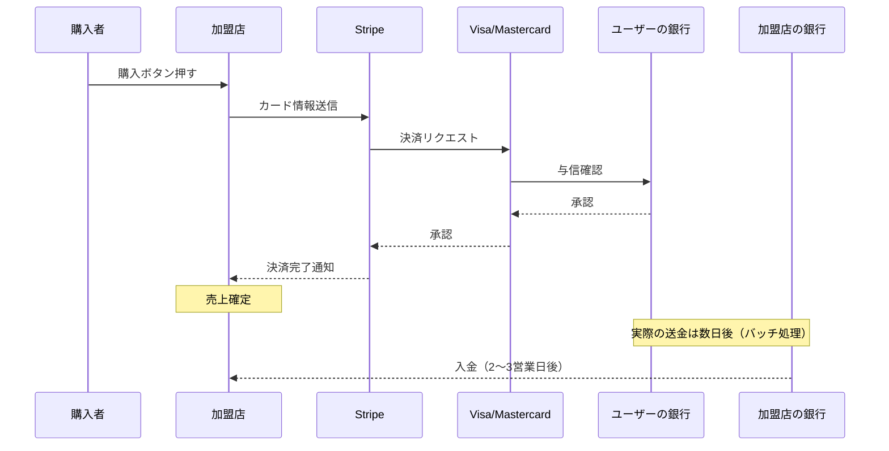
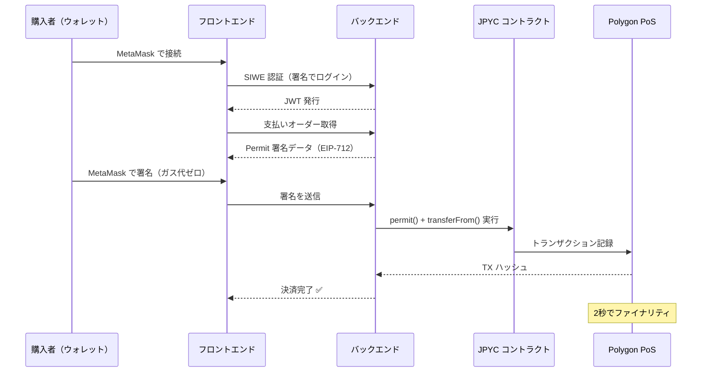
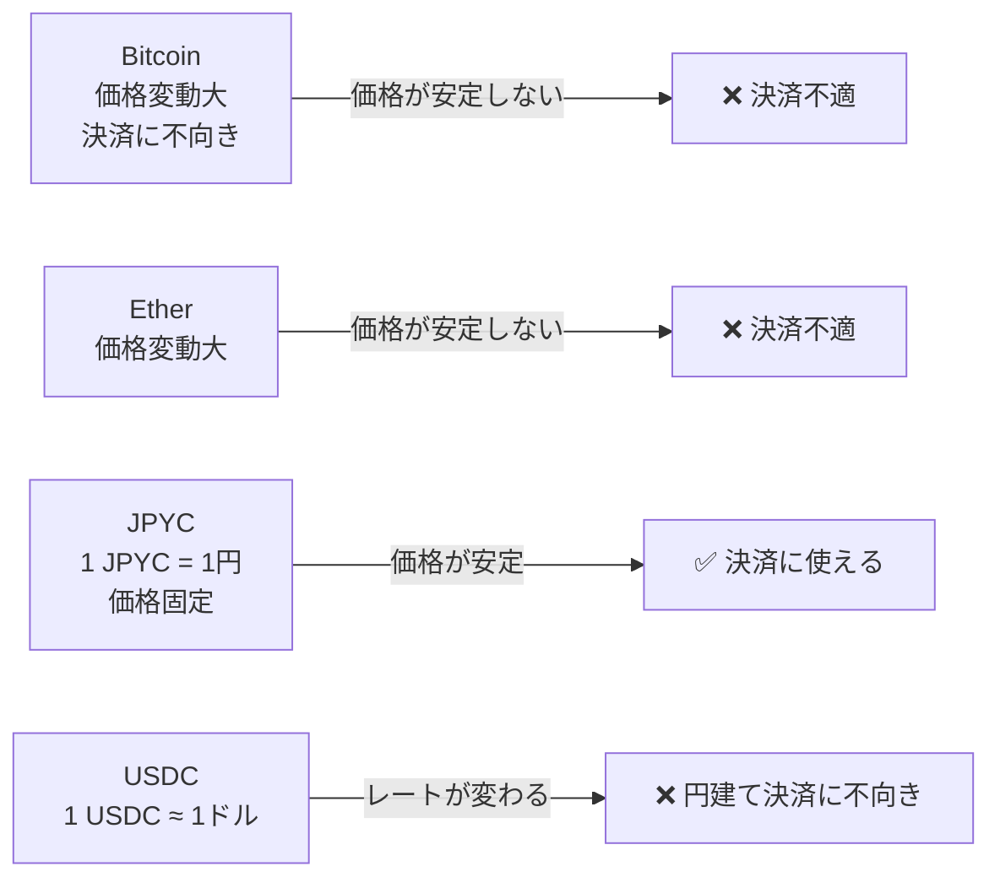

# レポート17 — Web3 決済 vs 従来決済：Stripe・銀行振込との本質的な違い

> 対象読者: 「なぜクレジットカードじゃダメなの？」という疑問を持つ人

---

## 1. 決済の本質とは何か

決済とは「AさんからBさんへ価値を移す」ことです。問題は **誰がその移転を記録・保証するか** です。

```
従来の決済:
  A → [銀行A] → [中央銀行 or カードネットワーク] → [銀行B] → B
  　　　　　　 ↑ここが単一障害点かつ手数料の源泉

Web3 の決済:
  A → [スマートコントラクト] → B
  　　　 ↑プログラムが自動実行、中間者なし
```

---

## 2. Stripe（クレジットカード）のフロー



**問題点:**
- 中間業者が多い → 手数料 3.6%（Stripe）+ カード手数料
- 加盟店への入金に 2〜3 営業日
- チャージバック（利用者が「身に覚えがない」と申告）で取消可能
- 国際送金はさらに複雑・高額（SWIFT 手数料）

---

## 3. このプロジェクトの Web3 決済フロー



**特徴:**
- 中間業者なし（コントラクトが直接実行）
- ガス代はバックエンドが負担（ユーザーは 0 円）
- 取消不可能（ブロックチェーンは不変）
- 2〜3 秒で完了（Polygon PoS）

---

## 4. コスト比較

### 手数料の構造

```
Stripe:
  購入者 → 加盟店 1,000円
  加盟店が受け取る: 1,000 - 36円（3.6%） = 964円

Web3（JPYC on Polygon）:
  購入者 → 加盟店 1,000 JPYC（= 1,000円）
  バックエンドがガス代: 約0.01 POL（= 約0.3円）
  加盟店が受け取る: 1,000 JPYC（ほぼそのまま）
```

| 項目 | Stripe | PayPal | 銀行振込（国内） | Web3（Polygon）|
|---|---|---|---|---|
| 手数料率 | 3.6% | 3.6%+ | 0円〜440円 | ~0.03% |
| 入金速度 | 2〜3日 | 数日 | 即日〜翌日 | 2〜3秒 |
| チャージバック | あり | あり | 難しい | **なし（不変）** |
| 国際送金 | 追加手数料 | 追加手数料 | 高額（SWIFT） | 同じコスト |
| 必要なもの | クレジットカード | アカウント | 銀行口座 | ウォレット |

### 年間 1億円の決済があったとしたら

```
Stripe:   手数料 360万円
Web3:     ガス代 約3万円（99%削減）
```

---

## 5. 「取消できない」は本当に問題か？

従来の常識: 「取消できることが安全」  
Web3 の考え方: 「最初から正しい取引だけ通すことが安全」

```
従来決済の問題:
  - 詐欺師がチャージバックを悪用（正規商品を受け取って返金申請）
  - 加盟店は年間数千億円の不正チャージバック被害

Web3 の解決策:
  - permit() に deadline（有効期限）がある
  - nonce で1回しか使えない
  - 署名したアドレスの残高分しか使えない
  → 「正しい取引」のみが通る設計
```

---

## 6. JPYC が円建てステーブルコインである理由



**JPYC のメリット:**
- 日本円で表示・決済できる（為替リスクなし）
- 電子決済手段（資金決済法対応）
- 法的に円の前払式支払手段として発行

---

## 7. Web3 決済の現在の課題

### UX の壁

```
従来決済の操作:
  1. カード番号入力
  2. CVV入力
  3. 完了

Web3 決済の操作（現状）:
  1. MetaMask インストール
  2. シードフレーズ保管
  3. JPYC を取引所で購入
  4. ウォレットに転送
  5. Polygon ネットワーク設定
  6. 支払いページで SIWE 認証
  7. 署名
  8. 完了
```

これが普及の最大の障壁。解決策 → report-18（アカウント抽象化）参照。

### 規制の壁

日本では JPYC は「前払式支払手段」として規制されており、JPYC → 円への換金が原則できない。詳細 → report-14（規制年表）参照。

---

## 8. Web3 決済が有利な具体的ユースケース

| ユースケース | なぜ Web3 が有利か |
|---|---|
| **国際送金**（出稼ぎ労働者の送金） | SWIFT 手数料($25〜)が数円に。フィリピン送金市場が注目 |
| **マイクロペイメント**（記事1本10円） | Stripe は最低手数料で割に合わない |
| **NFT / デジタルコンテンツ**（クリエイター報酬） | 二次流通でもロイヤリティ自動徴収 |
| **DAO 給与支払い**（グローバルチーム） | 銀行口座不要、Sablier でストリーミング（report-08参照） |
| **自動化決済**（定期購読） | スマートコントラクトが条件達成時に自動実行 |

---

## まとめ

```
従来決済（Stripe）:  信頼できる中間者に頼る
Web3 決済:          プログラムを信頼する（Trust the Code）

どちらが絶対的に優れているわけではない。
Web3 が特に強い領域: 国際送金・マイクロペイメント・取消不要な自動実行
従来が強い領域: UX・カスタマーサポート・法的保護
```

このプロジェクトは「Web3 決済が実際にどう動くか」を学ぶためのもの。  
将来的に UX の改善（アカウント抽象化・MPC ウォレット）が進めば、エンドユーザーは「ブロックチェーンを使っている」と意識しなくなるでしょう。
