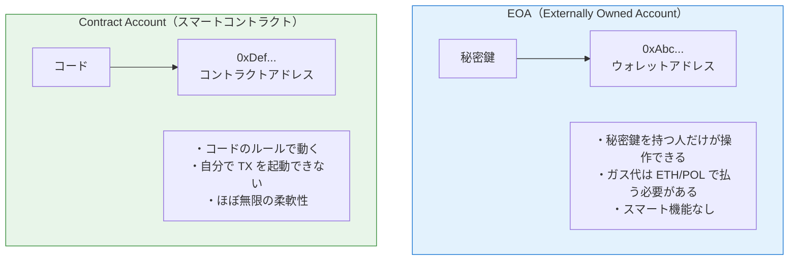
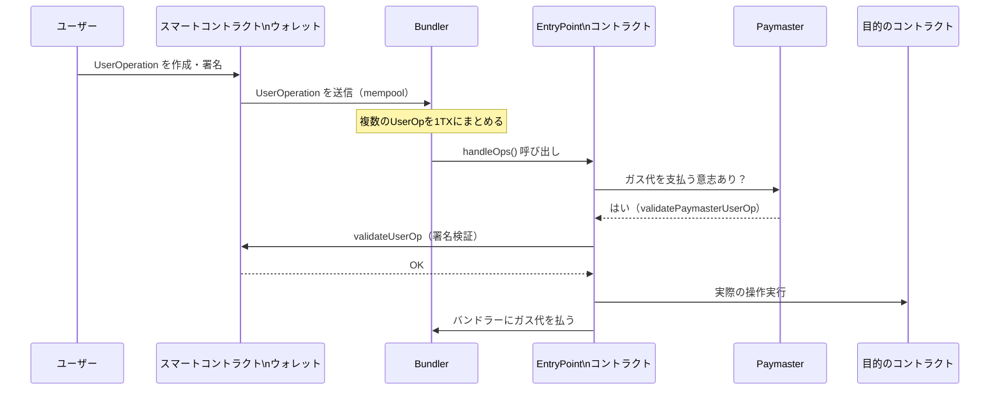
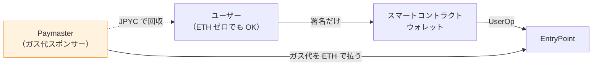
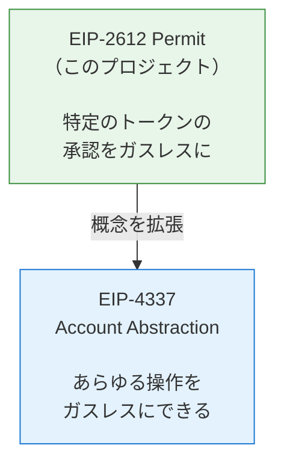

# レポート18 — アカウント抽象化と EIP-4337：Web3 UX 革命の全貌

> 「MetaMask のインストールが難しい」「ガス代が意味わからない」を解決する技術

---

## 1. 現在の Ethereum アカウントの2種類



**現在の問題:**
- MetaMask = EOA。秘密鍵を紛失したらアウト
- ガス代は必ずネイティブトークン（ETH/POL）が必要
- 複数の操作を1つのTXにまとめられない（ERC-20 approve + transfer = 2 TX）
- ソーシャルリカバリー（「友達3人が承認したら復元」）ができない

---

## 2. アカウント抽象化とは

「EOA の制約を取り除いて、スマートコントラクトがウォレットの機能を持てるようにする」こと。

```
今まで:
  ユーザー → EOA → コントラクト

アカウント抽象化:
  ユーザー → スマートコントラクトウォレット（= EOA + コントラクトの合体）
```

実現できること:
- **ガスレス取引**: 第三者（Paymaster）がガス代を肩代わり
- **ガストークン変更**: JPYC でガス代を払う
- **バッチ処理**: approve + transfer を 1TX で実行
- **ソーシャルリカバリー**: 秘密鍵を失っても復元可能
- **セッションキー**: 「1時間以内、1万円以下のゲーム内取引は自動承認」

---

## 3. EIP-4337 の仕組み

2023年3月に Ethereum メインネットでデプロイされた標準仕様。



**キーワード解説:**

| 用語 | 役割 | 例え |
|---|---|---|
| UserOperation | 「やりたい操作」のデータ構造 | 注文書 |
| Bundler | UserOperation をまとめてブロックチェーンに送る | 運送業者 |
| EntryPoint | EIP-4337 の中核コントラクト | 取引所の受付 |
| Paymaster | ガス代を代わりに払う | 会社の経費精算 |
| Factory | 新しい SCW を展開する | 銀行の口座開設 |

---

## 4. Paymaster の仕組み（ガスレス体験）



**実際のユースケース:**
- **DApp スポンサー型**: ゲーム会社がガス代を負担（ユーザーに財布を開かせない）
- **トークン決済型**: JPYC でガス代を払う（ETH ゼロでも使える）
- **サブスクリプション型**: 定期購入ならガス代無料

---

## 5. このプロジェクトの EIP-2612 との関係

このプロジェクトで実装した EIP-2612 Permit は、アカウント抽象化の **先駆け** です。

```
EIP-2612 Permit:
  ユーザーが署名だけ → バックエンドがガス代を払って TX を実行
  → ユーザーは POL/ETH ゼロでも JPYC を送れる

EIP-4337 Account Abstraction:
  同じ概念をさらに汎用化 → あらゆる操作をガスレスにできる
```



---

## 6. 実装例：Safe（旧 Gnosis Safe）

最も普及しているスマートコントラクトウォレット。

```
Safe の特徴:
  - マルチシグ: 5人中3人が承認したら実行
  - 企業の財務管理に最適
  - Polygon 対応あり
  - TVL（ロック済み資産）: 1000億ドル超

活用例:
  - DAO の共同財務（全メンバーが残高を見られる）
  - 企業のトークン管理（CFO・CTOの両方の署名が必要）
  - 高額決済の二重承認
```

---

## 7. Biconomy / ZeroDev（AA の実装ライブラリ）

Web3 開発者向けの AA ミドルウェア。

```typescript
// ZeroDev での実装例（概念）
const kernelClient = createKernelAccountClient({
  account: kernelAccount,
  paymaster: sponsorUserOperation, // ガス代を DApp が負担
})

// ユーザーはガス代なしで ERC-20 を送れる
await kernelClient.sendTransaction({
  to: JPYC_ADDRESS,
  data: encodeFunctionData({ abi: ERC20_ABI, functionName: 'transfer', args: [recipient, amount] })
  // value: 0 — ETH が不要！
})
```

---

## 8. アカウント抽象化の現在と未来

```
現在（2024-2025）:
  ✅ EIP-4337 メインネットデプロイ済み
  ✅ Biconomy, ZeroDev, Pimlico などのインフラ整備完了
  ✅ Base (Coinbase L2) でのガスレス体験が普及中
  ⚠️ まだ EOA が主流

将来（2025-2027）:
  🎯 ネイティブ AA（EIP-7702）: EOA がそのまま SCW になれる
  🎯 スマートフォンのセキュアエンクレーブ = ウォレット
  🎯 「ウォレット」という概念が消える → 普通のアプリと同じ UX
```

**EIP-7702（2025年 Pectra アップグレードで導入予定）:**
既存の EOA に一時的なコードを割り当てることができる。  
「今持っている MetaMask アドレスをそのまま SCW として使える」

---

## まとめ

| 技術 | できること | 難易度 |
|---|---|---|
| EIP-2612 Permit（実装済み） | トークン承認のガスレス化 | ★★★☆☆ |
| EIP-4337 Account Abstraction | あらゆる操作のガスレス化 | ★★★★☆ |
| Safe Multi-sig | 多署名承認 | ★★★☆☆ |
| EIP-7702 | EOA を SCW に変換 | ★★★★★ |

このプロジェクトの Permit 実装は、アカウント抽象化の考え方（「署名する人とガスを払う人を分離する」）を先取りしています。  
次のステップとして EIP-4337 の Paymaster を追加すれば、ユーザーが POL を一切持たなくてもJPYC 決済ができるシステムになります。
