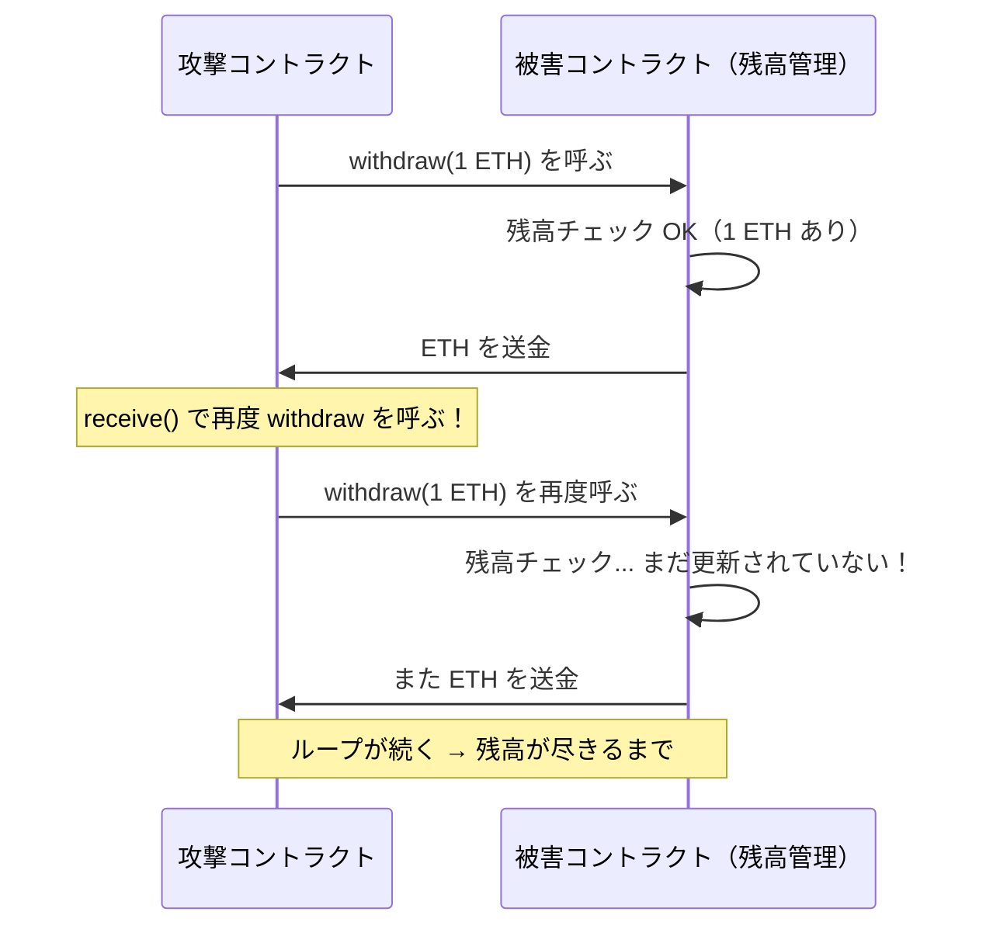
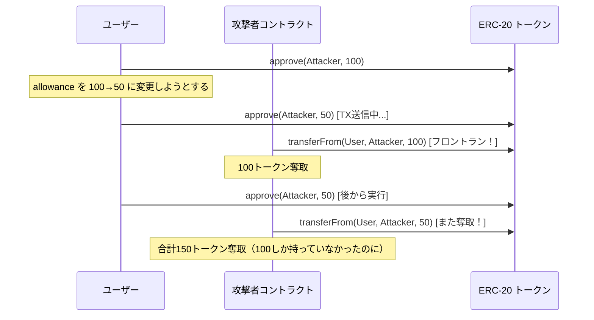
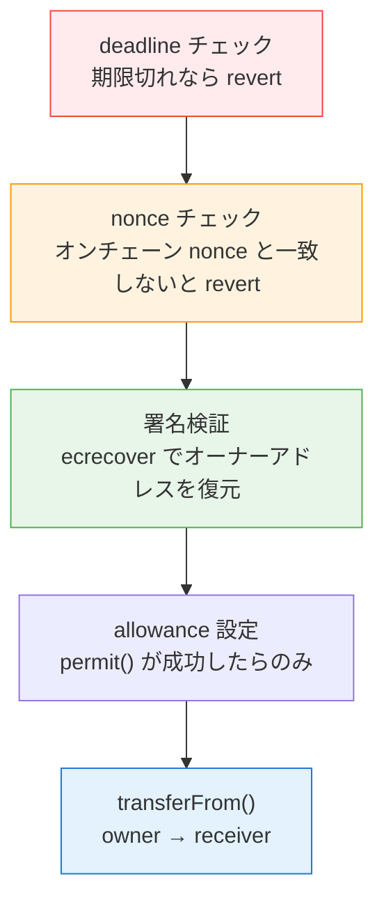

# レポート19 — スマートコントラクトセキュリティ：なぜハックが起き、どう防ぐか

> 「The DAO ハック（60億円）」「Poly Network ハック（620億円）」は何が問題だったのか

---

## 1. スマートコントラクトが「危険」な理由

```
通常のソフトウェアのバグ:
  発見 → パッチを配布 → ユーザーがアップデート → 終了

スマートコントラクトのバグ:
  デプロイ後は「コードが変えられない」（イミュータビリティ）
  発見 → 攻撃者が先に悪用 → 資金が消える → 取り戻せない
```

さらに、コントラクトのソースコードは **Etherscan で誰でも見られます**。つまり、バグを見つけた攻撃者が「脆弱性のある関数」を特定して狙い撃ちできます。

---

## 2. 代表的な脆弱性パターン

### 2-1. リエントランシー攻撃（Reentrancy）

**歴史:** 2016年 The DAO ハック — 360万 ETH（約60億円）が盗まれた

**仕組み:**



**脆弱なコード（Solidity）:**
```solidity
function withdraw(uint amount) external {
    require(balances[msg.sender] >= amount);
    // ❌ 送金を先にしてから残高を更新している
    (bool success, ) = msg.sender.call{value: amount}("");
    balances[msg.sender] -= amount; // ← ここが呼ばれる前に再入される
}
```

**安全なコード（Checks-Effects-Interactions パターン）:**
```solidity
function withdraw(uint amount) external {
    require(balances[msg.sender] >= amount); // Check
    balances[msg.sender] -= amount;          // Effect（先に更新）
    (bool success, ) = msg.sender.call{value: amount}(""); // Interaction（後で送金）
    require(success);
}
```

**または OpenZeppelin の ReentrancyGuard を使う:**
```solidity
import "@openzeppelin/contracts/security/ReentrancyGuard.sol";

contract SafeVault is ReentrancyGuard {
    function withdraw(uint amount) external nonReentrant { ... }
}
```

---

### 2-2. ERC-20 approve の二重使用問題

**仕組み:**



**EIP-2612 Permit がこれを解決する理由:**
```
従来の approve:
  allowance を更新するだけ → 間にフロントランが入れる

EIP-2612 Permit:
  署名に deadline（有効期限）と nonce が含まれている
  → 1回しか使えず、有効期限が過ぎたら無効
  → フロントラン自体は可能だが、「使い捨て」なので被害が限定的
```

---

### 2-3. 整数オーバーフロー / アンダーフロー

**Solidity 0.8.0 以前の問題:**
```solidity
uint8 balance = 0;
balance -= 1; // 0 - 1 = 255（アンダーフロー！）
// 残高ゼロのユーザーが大量のトークンを持つことに
```

**現代（Solidity 0.8+）:**
```solidity
// 自動的にオーバーフローを検出して revert する
// SafeMath ライブラリは不要になった
uint8 balance = 0;
balance -= 1; // → revert！（パニック）
```

---

### 2-4. アクセス制御の欠如

**代表的な事例:** 2022年 Ronin ブリッジ（アクセス制御の設定ミス）→ 830億円被害

```solidity
// ❌ 誰でも mint できてしまう
function mint(address to, uint amount) external {
    _mint(to, amount);
}

// ✅ オーナーだけが mint できる
function mint(address to, uint amount) external onlyOwner {
    _mint(to, amount);
}
```

---

### 2-5. フラッシュローン攻撃

```
フラッシュローン: 「同じTX内で返済する」ことを条件に担保なしで借りられる

攻撃手順:
  1. フラッシュローンで大量のトークンを借りる（例: 1億ドル）
  2. 借りたトークンで価格を操作する
  3. 操作された価格を使ったプロトコルを攻撃する
  4. 利益を確定して返済
  → 1 TX の中で完結
```

---

## 3. このプロジェクトのセキュリティ設計

### EIP-2612 Permit の安全性



**多層防御:**

| チェック | 場所 | 効果 |
|---|---|---|
| deadline | PermitService.java（サーバー）+ コントラクト | 古い署名の再利用防止 |
| nonce 検証 | PermitService.java（オンチェーン取得） | リプレイ攻撃防止 |
| 署名検証（オフチェーン） | PermitService.java（ecrecover） | ガス無駄遣い防止 |
| 署名検証（オンチェーン） | JPYC コントラクト内 | 最終防衛 |
| TX_HASH_PATTERN | PermitService.java | 不正ハッシュの保存防止 |
| ETH_ADDRESS_PATTERN | Controller・Service 層 | アドレスインジェクション防止 |

---

## 4. スマートコントラクト監査

本番環境のコントラクトは必ず第三者監査が必要です。

### 自動化ツール

```
Slither（Trail of Bits）:
  コードを静的解析してバグパターンを検出
  $ slither . --print human-summary

Mythril:
  シンボリック実行でリエントランシーを検出

Echidna（ファジング）:
  ランダム入力を大量に試してエッジケースを発見
```

### 手動監査の重要性

```
自動ツールで検出できないもの:
  - ビジネスロジックのバグ（「こういう使い方をされると破綻する」）
  - フラッシュローンとの組み合わせ攻撃
  - 経済的な攻撃（ゲーム理論的な抜け穴）

有名な監査会社:
  - Trail of Bits（アメリカ）
  - Certik（アメリカ・中国）
  - OpenZeppelin（アメリカ）
  - Iosiro（オーストラリア）
  - 監査費用: $50,000 〜 $500,000
```

---

## 5. OpenZeppelin — 安全なコントラクトのライブラリ

```solidity
// このプロジェクトで JPYC が使っている（はずの）安全なパターン
import "@openzeppelin/contracts/token/ERC20/extensions/ERC20Permit.sol";

contract JPYC is ERC20Permit {
    // EIP-2612 の permit() が安全に実装済み
    // OpenZeppelin のコードは監査済み・実績あり
}
```

OpenZeppelin の特徴:
- すべてのコードが複数回監査済み
- GitHub で公開・コミュニティがレビュー
- Ethereum エコシステムのデファクトスタンダード

---

## 6. よくある「なんとなく危険な」コードパターン

```solidity
// ❌ 1: block.timestamp の操作
if (block.timestamp % 2 == 0) { // バリデータが少し操作できる
    winner = msg.sender;
}

// ❌ 2: tx.origin の使用（フィッシング攻撃に弱い）
require(tx.origin == owner); // msg.sender を使うべき

// ❌ 3: delegatecall の誤用（ストレージ衝突）
// Proxy パターンで正しく使わないと任意コード実行の原因に

// ❌ 4: コントラクトの ETH 残高に依存
if (address(this).balance == 1 ether) { // selfdestruct で操作できる
    ...
}
```

---

## まとめ

| 脆弱性 | 有名な被害 | 対策 |
|---|---|---|
| リエントランシー | The DAO (60億円) | Checks-Effects-Interactions + ReentrancyGuard |
| アクセス制御 | Ronin (830億円) | OpenZeppelin AccessControl |
| フラッシュローン | Beanstalk (200億円) | タイムロック・TWAP |
| オラクル操作 | Mango Markets (115億円) | 複数オラクルの使用 |
| 整数オーバーフロー | BEC Token（大量） | Solidity 0.8+ 使用 |

**このプロジェクトの立ち位置:**  
独自のスマートコントラクトを書かず、監査済みの JPYC コントラクトを呼び出すだけです。セキュリティリスクはバックエンドの実装（署名検証・バリデーション）に集中しており、そこを丁寧に実装しています。
