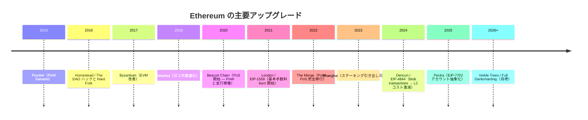
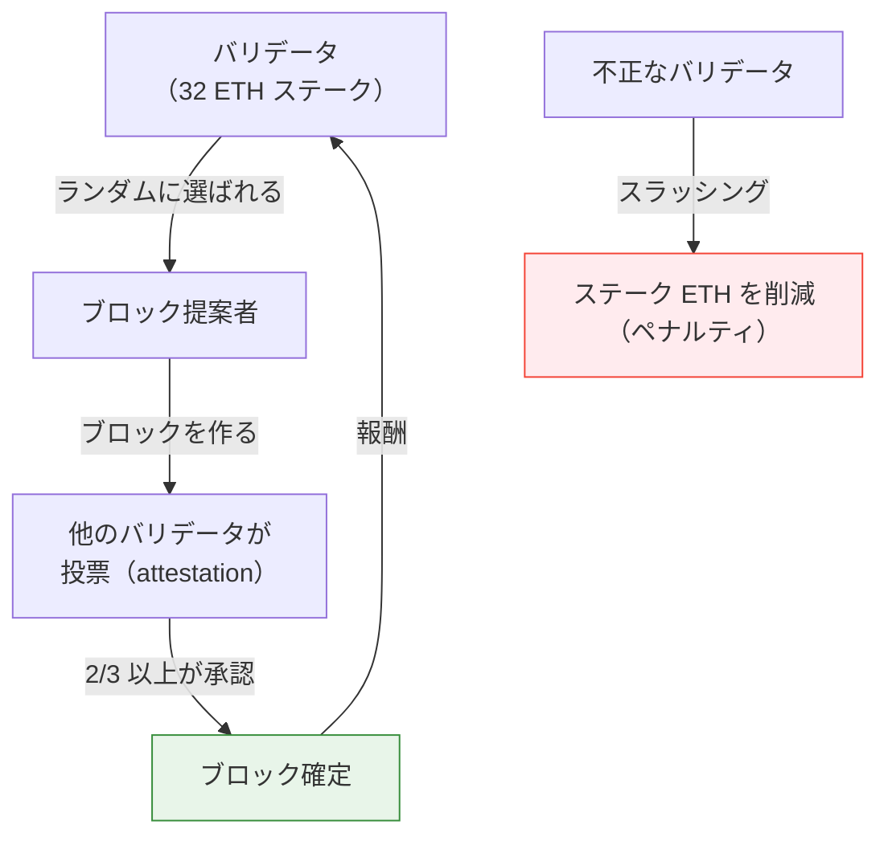
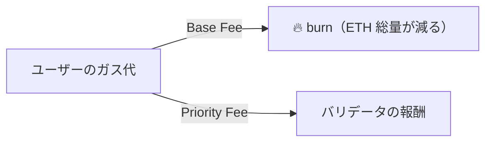
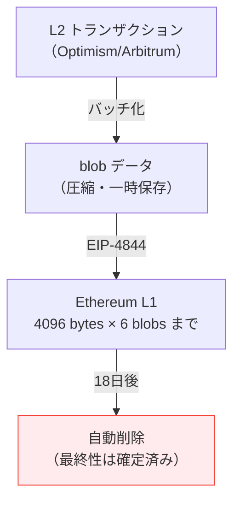

# レポート20 — Ethereum ロードマップ：PoS 移行から将来の Danksharding まで

> 「Ethereum はどこへ向かっているのか」を理解すると、L2 の未来とガス代の行方が見えてくる

---

## 1. Ethereum の歴史的変遷



---

## 2. The Merge（2022年9月）— PoW → PoS

### PoW（プルーフ・オブ・ワーク）の問題

```
Bitcoin / 旧 Ethereum の採掘:
  大量の電力 → ハッシュ計算競争 → 当選者がブロックを作る
  年間電力消費 ≈ スウェーデン1国分
```

### PoS（プルーフ・オブ・ステーク）の仕組み



**The Merge の結果:**
- 電力消費: **99.95% 削減**（スウェーデン → 小さな町）
- ETH の発行量: 大幅削減（マイナーへの報酬がなくなった）
- 「The Flippening」候補: PoS ETH はセキュリティ的に Bitcoin に迫ってきた

---

## 3. EIP-1559（2021年 London）— ガス代の仕組みを変えた

### 旧モデル（第一価格オークション）

```
ユーザーA: 「100 Gwei 出す！」
ユーザーB: 「150 Gwei 出す！」
マイナー: 一番高い人を優先

問題: ガス代が読めない・マイナーが儲けすぎ
```

### EIP-1559 のモデル

```
Base Fee（基本手数料）:
  - ネットワークが「今の混雑度」に応じて自動設定
  - 全額 burn（ETH を焼却）！
  - ブロックが50%埋まるようにアルゴリズムで調整

Priority Fee（チップ）:
  - バリデータへの上乗せ
  - ユーザーが任意で設定
```



**影響:**
- ETH は「デフレ資産」になりうる（burn > 発行量の時期がある）
- ガス代の予測が容易になった
- MetaMask の表示が「基本 + チップ」に変わった

---

## 4. EIP-4844（2024年3月 Dencun）— L2 のガス代を1/10に

### blob transactions の概念

L2 は定期的にデータを Ethereum L1 に記録します。問題は「データを calldata として送ると非常に高い」こと。

```
Before EIP-4844:
  Optimism が L1 に送るデータ = calldata として記録
  → 永久にブロックチェーンに残る → 高い

After EIP-4844:
  blob（Binary Large Object）として記録
  → 約18日後に自動削除
  → 安い！（L2 の目的は最終性の保証だけで、データの永久保存は不要）
```



**実際の影響（Dencun アップグレード翌日）:**

```
Optimism のトランザクション手数料:
  Before: $0.50〜$2.00
  After:  $0.001〜$0.01（99%削減）

Arbitrum:
  Before: $0.30〜$1.00
  After:  $0.001〜$0.005（99.5%削減）
```

---

## 5. Verkle Trees — 近い将来の改善

Ethereum の状態データは現在 Merkle Patricia Tree で管理されています。

```
現在: Merkle Patricia Tree
  ↓
  証明サイズ: ~1kB〜10kB
  ライトクライアント（スマホ）では全データをダウンロードできない

Verkle Tree（近い将来）:
  ↓
  証明サイズ: ~150B（90%削減）
  スマートフォンでも Ethereum フルノードに近い検証ができる
```

**「Stateless Clients」の実現:**  
ノードが全履歴データを保持しなくても Ethereum に参加できるようになる。  
→ 個人のラズパイでもバリデータになれる → 分散性向上

---

## 6. Full Danksharding（将来の目標）

EIP-4844 は「Proto-Danksharding」と呼ばれる第一歩です。

```
EIP-4844（現在）:
  6 blobs × 128KB = 768KB/ブロック追加
  L2 コスト: 大幅削減

Full Danksharding（目標）:
  256 blobs × 128KB = 32MB/ブロック
  → 分散型 L2 に必要な帯域を Ethereum が提供

必要技術:
  - PeerDAS（データ可用性サンプリング）
  - KZG コミットメント（暗号技術）
  - バリデータがデータを分散保持
```

---

## 7. このプロジェクトへの影響

```
現在の設定:
  - JPYC on Polygon PoS（EIP-4844 の恩恵なし、Polygon 独自の安さ）
  - DAI on Ethereum L1（高い）

将来の選択肢:
  1. Polygon PoS のまま → 十分安いが Ethereum L1 のセキュリティなし
  2. USDC on Arbitrum → EIP-4844 の恩恵、Ethereum セキュリティ、Circle ネイティブ
  3. JPYC on Polygon zkEVM → ZK セキュリティ + JPYC ネイティブ（現在開発中）
```

---

## 8. Ethereum ロードマップのフェーズ名

Vitalik Buterin が名付けた各フェーズ:

```
The Merge  ← 完了（PoW → PoS）
The Surge  ← 進行中（Rollup + EIP-4844 → Danksharding）
The Scourge ← 計画中（MEV 問題の解決、分散性強化）
The Verge  ← 計画中（Verkle Trees）
The Purge  ← 計画中（不要な履歴データの削除、シンプル化）
The Splurge ← 計画中（その他の改善）
```

---

## まとめ

| アップグレード | 年 | 意義 |
|---|---|---|
| The Merge | 2022 | 電力99.95%削減、PoS 移行 |
| EIP-1559 | 2021 | ガス代モデル改革、ETH burn |
| EIP-4844 | 2024 | L2 ガス代99%削減 |
| Verkle Trees | ~2026 | 軽量ノード実現 |
| Full Danksharding | ~2027 | L2 スループット100x |

Ethereum は「L1 をセキュリティ層、L2 を実行層」として設計を進めています。  
このプロジェクトで使っている Polygon PoS は現状でも安価ですが、  
将来的には **Ethereum L2（Arbitrum/Base）+ EIP-4844** の組み合わせが  
「安全性と安さの最適解」になる可能性が高いです。
